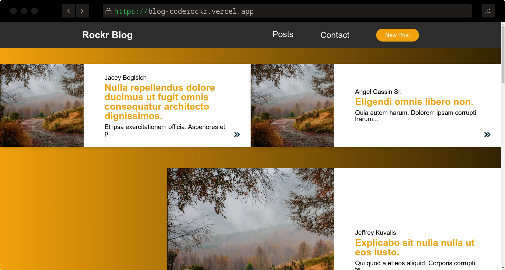
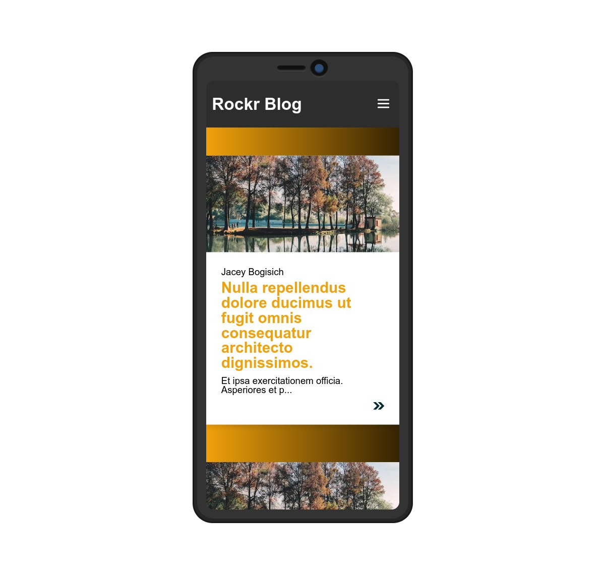

# Blog Coderockr

| Desktop | Mobile |
| ------- | ------ |
|  |  |

## Features :star:

- Infinite scroll page
- Single article page
- Contact modal
- XSS (Cross-site scripting) Prevention
- Responsive layout
- Post creation
- Performance
- SEO
- SSR (Server-side Rendering)

## Dependencies :package:

- [Next.js](https://nextjs.org/) - Modern framework to render React  on the server (SSR)
- [DOMPurify](https://github.com/cure53/DOMPurify) and [Isomorphic DOMPurify](https://github.com/kkomelin/isomorphic-dompurify) - Sanitize content and prevent XSS
- [Phosphor React](https://phosphoricons.com/) - Icons library

## Running the project

### Development Server

To run the development server follow the steps:

Create a `.env.local` in the root of the project and put the following content with the API URL:

```env
NEXT_PUBLIC_API_URL="PUT THE API URL HERE"
```

Run the application:

```sh
# NPM
npm install && npm run dev

# Yarn
yarn install && yarn dev
```

### Build the Project

To build and run the project locally follow the steps:

Create a `.env.production` in the root of the project and put the following content with the API URL:

```env
NEXT_PUBLIC_API_URL="PUT THE API URL HERE"
```

Build the application:

```sh
# NPM
npm install && npm run build

# Yarn
yarn install && yarn build
```

After the build, run the application:

```sh
# NPM
npm run start

# Yarn
yarn start
```
